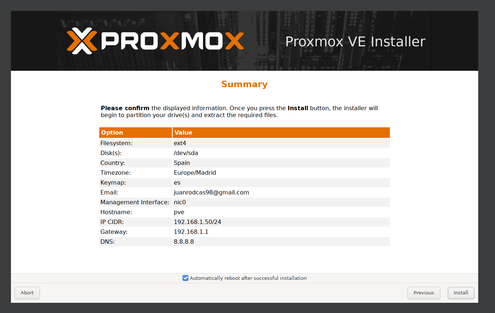
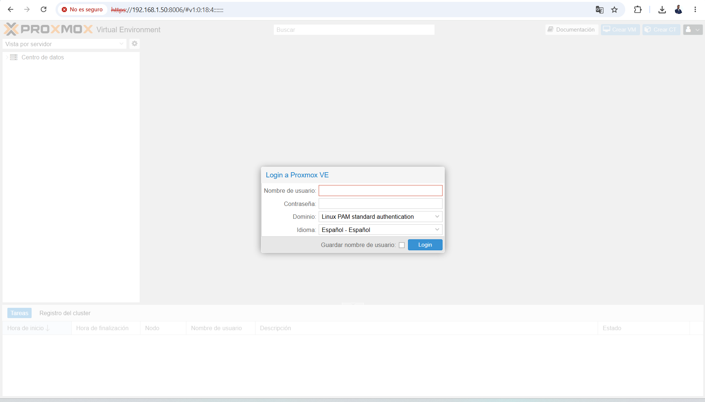
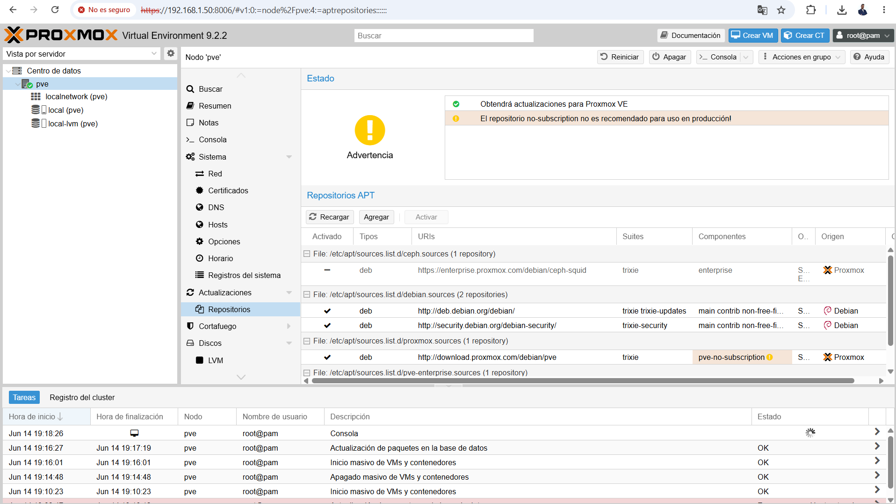
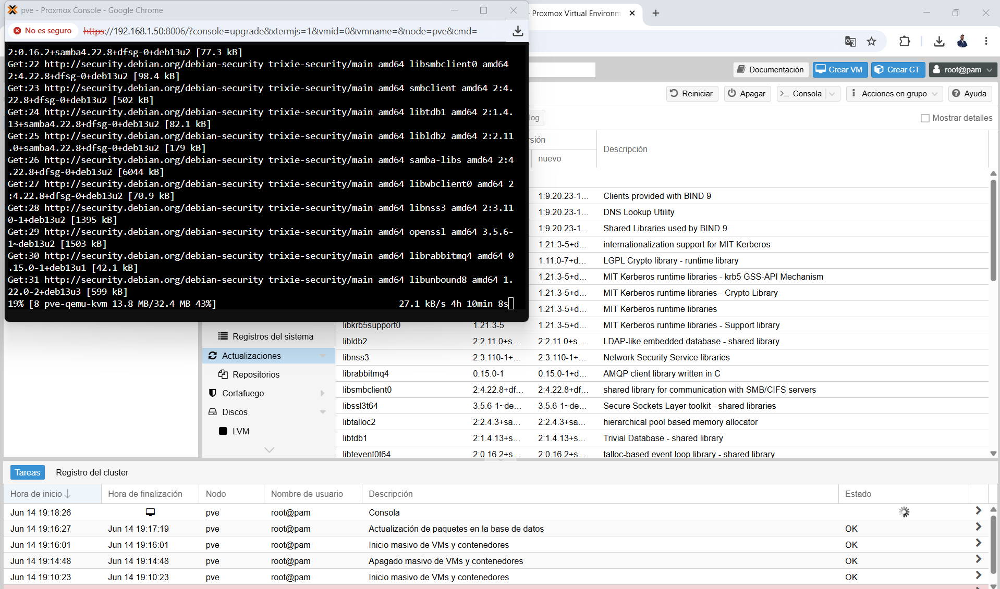
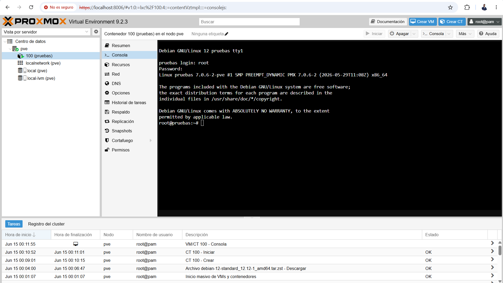

# Fase 1 · Base — Proxmox VE

> Estado: ✅ Completa · Fecha: 14-15/06/2026

## Objetivo

Tener el hipervisor funcionando, con almacenamiento sólido y la red preparada. Es el suelo sobre el que se apoya todo lo demás: si esta capa está mal, arrastro el error a las cuatro fases siguientes. Así que aquí no corro: prefiero dejar la base firme y entendida.

## Mi entorno de partida

Monto el laboratorio en mi portátil (IdeaPad Slim 3, i5-12450H, 16 GB de RAM). Como Proxmox se instala *bare-metal* y no voy a borrar el equipo, lo levanto **dentro de una VM** (virtualización anidada). No es lo ideal en rendimiento, pero para aprender, montar el flujo completo y documentarlo, sirve de sobra.

- **Versión:** Proxmox VE 9.2.3
- **Recursos de la VM:** 8 GB de RAM, 4 vCPUs (con virtualización anidada activada), 100 GB de disco

## Lo que hice, paso a paso

### 1. Instalación

Arranqué el instalador gráfico y, cuando llegó la pantalla del disco, tomé la primera decisión con criterio: **elegí ext4 (LVM) en vez de ZFS**. ZFS es estupendo, pero se come varios GB de RAM en caché, y en un montaje anidado con 16 GB esos GB los necesito para las máquinas que voy a levantar. ZFS lo dejo para el día que monte esto sobre hardware dedicado.

### 2. Primer acceso al panel

Tras instalar, entré al panel web con el usuario `root`. El aviso de "no es seguro" del navegador es el certificado autofirmado: normal en un lab.

### 3. Repositorios y actualización

Proxmox viene apuntando por defecto al repositorio *enterprise* (de pago), así que el primer `apt update` falla. La solución es usar el repositorio gratuito: **desactivé el `pve-enterprise` y activé el `pve-no-subscription`**. La suscripción de pago en Proxmox no desbloquea funciones, solo da soporte y el repo enterprise; con el gratuito tengo el sistema completo.

Con los repositorios bien puestos, actualicé el sistema (quedó en la versión 9.2.3) y reinicié el nodo.

### 4. Primer contenedor LXC

Para cerrar la fase, descargué una plantilla **Debian 12 standard** y creé mi primer contenedor LXC a partir de ella (1 vCPU, 512 MB de RAM, red en DHCP). Arrancó a la primera y pude entrar a su consola como `root`. Tener algo corriendo encima es lo que convierte "instalé Proxmox" en "tengo un hipervisor operativo".

## Problemas que me encontré (y cómo los resolví)

Esta es, para mí, la parte que más vale de documentar: lo que no sale a la primera.

- **La VM volvía al instalador en bucle.** Tras instalar y reiniciar, en vez de arrancar Proxmox me devolvía a la pantalla de instalación. El motivo: la ISO seguía conectada al CD/DVD virtual y tenía prioridad de arranque. **Solución:** desconectar la ISO de la unidad virtual. Arrancó del disco a la primera.

- **Acceso al panel vs. velocidad de descarga: el equilibrio de la red.** Aquí aprendí lo que mejor me llevo de esta fase. Con la VM en modo **puente (bridged)**, Proxmox quedaba en mi red doméstica y el panel era accesible sin más, pero las descargas de paquetes (sobre Wi-Fi) iban lentísimas. Con la VM en **NAT**, las descargas volaban, pero el panel no era accesible directamente desde el navegador del host. **Solución:** quedarme en NAT (por la velocidad) y añadir un **reenvío de puertos** (host `8006` → invitado `8006`), accediendo al panel por `https://localhost:8006`. Así tengo lo mejor de ambos: descargas rápidas y acceso cómodo.

- **IP fija vs. DHCP en NAT.** Intenté fijar una IP estática y me daba problemas de acceso. Entendí que en una red NAT lo natural es **dejar que el DHCP asigne la IP**, en vez de forzar una a mano: el propio gestor de red te da una dirección válida del rango correcto sin que tengas que adivinarlo. Cambié `vmbr0` a DHCP y se resolvió.

## Lo que me llevo de esta fase

- La diferencia real entre un hipervisor de **tipo 1** (Proxmox, sobre el hardware) y los de **tipo 2** que usaba en el ciclo (VirtualBox, VMware): no es "una app para virtualizar", es el sistema operativo del servidor.
- Por qué **ext4 frente a ZFS** según el contexto: la mejor herramienta depende de los recursos que tienes, no de cuál es "más potente".
- Los **modos de red en virtualización** (puente vs NAT) y sus compromisos: acceso frente a rendimiento, y cómo el reenvío de puertos y el DHCP resuelven el equilibrio.
- El modelo de **repositorios de Proxmox** (gratuito vs enterprise) y que el gratuito es completo.
- Que en infraestructura, **la base bien hecha es lo que sostiene todo lo demás**. Sin un hipervisor sólido, ni la monitorización ni el backup tienen sentido.

## Siguiente paso

**Fase 2 · Servicios e identidad:** OPNsense para la red, Active Directory para la identidad, y un host Docker con algún servicio.
