# Fase 2 · Servicios e identidad

> Estado: 🟡 En progreso · Fecha: 16/06/2026

## Objetivo

Que el laboratorio empiece a parecerse a una empresa: una red segmentada con un firewall que la gobierna, identidad con un directorio de usuarios, y algún servicio real corriendo. Si la Fase 1 fue el suelo, esta es la que le da forma de organización.

## Decisión de plataforma: del Proxmox anidado a VMware

Monté la Fase 1 con Proxmox dentro de una VM (virtualización anidada) para aprender el hipervisor, y funcionó. Pero al llegar a la Fase 2 —donde hay que levantar máquinas virtuales completas *dentro* de Proxmox— me topé con un límite real: el equipo (Windows 11 con Seguridad Basada en Virtualización forzada por el fabricante) no permite la virtualización anidada que ese escenario exige, ni en VirtualBox ni en VMware.

Tras diagnosticarlo a fondo (VBS seguía activa pese a desactivarla por todos los métodos), tomé una **decisión pragmática**: desplegar los servicios del laboratorio directamente como VMs sobre VMware Workstation, sin Proxmox de intermediario. El conocimiento de Proxmox queda demostrado en la Fase 1; el resto del lab (red, identidad, servicios, monitorización y backup) es igual de válido y demostrable sobre VMware.

> Aprendizaje: a veces el mejor criterio técnico no es insistir, sino reconocer un límite del entorno y adaptar el plan sin perder el objetivo.

## Pieza 1 · OPNsense — el firewall y la red

### Por qué primero

OPNsense es el cerebro de la red: define la estructura (LAN/WAN, segmentación) sobre la que vivirán las demás máquinas. Montar la red antes que los servicios evita tener que reconfigurar después.

### Montaje

- VM en VMware: FreeBSD 64-bit, 2 GB RAM, 2 vCPUs, disco 20 GB.
- **Dos interfaces de red**, que es lo que hace de OPNsense un firewall:
  - **WAN** → adaptador NAT de VMware (salida a internet).
  - **LAN** → red privada VMnet1 (host-only), la red interna del lab.
- Instalación con UFS (más ligero que ZFS para el lab).

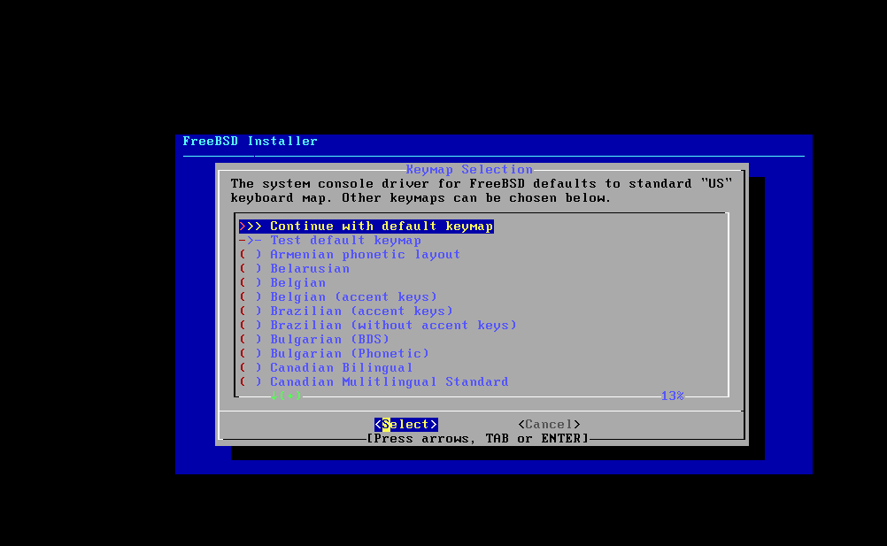

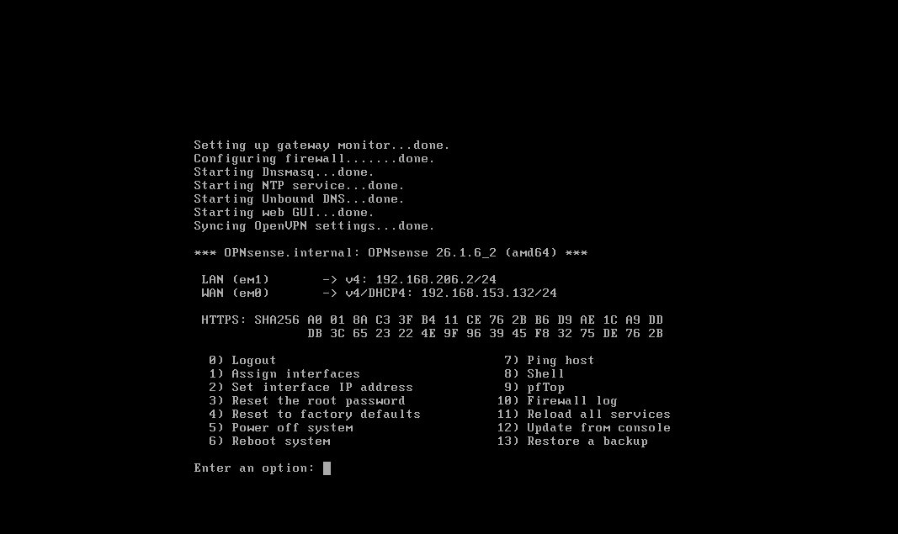

### Configuración

Pasé el asistente inicial (DNS, zona horaria Europe/Madrid, contraseña de root) y dejé OPNsense operativo, administrable desde su panel web.

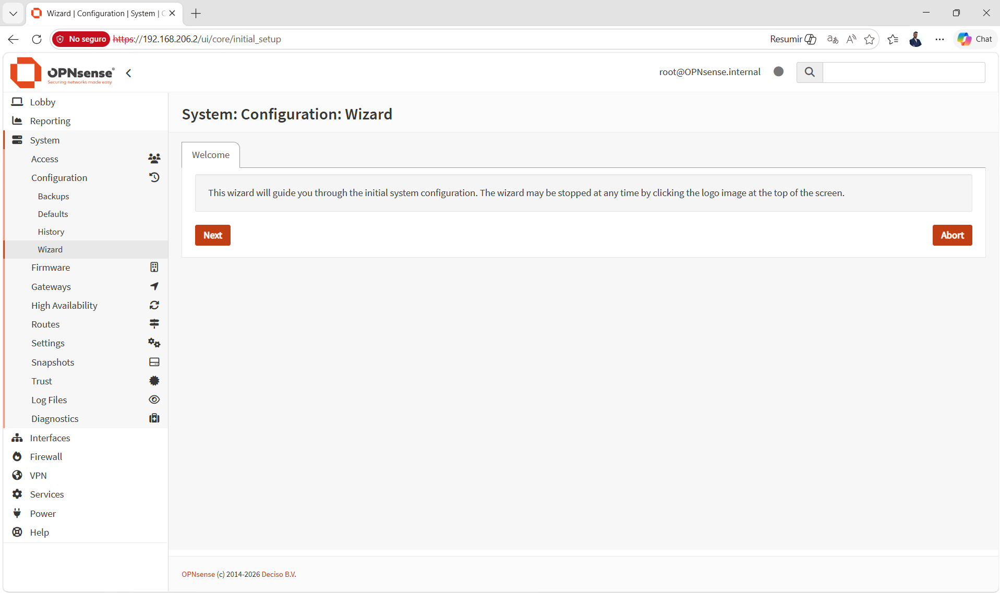

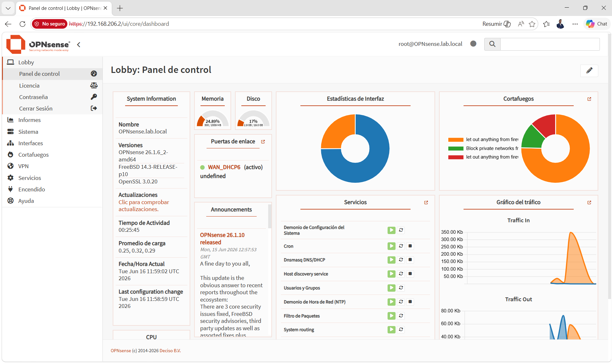

### Problemas que me encontré (y cómo los resolví)

- **Choque de redes con la doméstica.** OPNsense asigna por defecto `192.168.1.1` a su LAN, que es justo la IP de mi router de casa. Al intentar entrar al panel, el navegador iba al router, no a OPNsense. **Aprendizaje:** la red del lab nunca debe solapar con la red doméstica. **Solución:** cambiar la LAN a otro rango.

- **Interfaces WAN/LAN invertidas.** OPNsense había emparejado la WAN con el adaptador de la red privada (VMnet1, donde está mi PC) y la LAN con el de NAT, justo al revés de lo necesario. Por eso el panel, que se sirve por la LAN, no era accesible desde mi equipo. **Solución:** reasignar las interfaces (`Assign interfaces`) para que la LAN quedara en VMnet1, y darle una IP de ese rango. Tras eso, acceso al panel a la primera. **Aprendizaje:** identificar qué interfaz física corresponde a cada red es la base de cualquier configuración de firewall.

### Estado

OPNsense funcionando como router/firewall del lab, con la red interna lista para que se conecten el resto de máquinas.

## Pieza 2 · Active Directory — la identidad

### Por qué

Si OPNsense pone orden en la red, Active Directory lo pone en las personas: un único sitio donde viven los usuarios, los grupos y las políticas, y un DNS interno que sostiene todo el dominio. Es la pieza que convierte "unas máquinas en una red" en "una organización".

### Montaje

- VM en VMware: **Windows Server 2022 Standard (Experiencia de escritorio)**, 4 GB RAM, 2 vCPUs, disco 50 GB.
- Red en **VMnet1** (la LAN del lab, detrás de OPNsense).
- Elegí la edición **con experiencia de escritorio** y no Server Core a propósito: para aprender y documentar con capturas, la interfaz gráfica acompaña. Core lo dejo para el día que quiera el reto de hacerlo todo por PowerShell.

### Preparar el servidor antes de promover

Un controlador de dominio **no puede ir en DHCP**: va a ser el DNS y el corazón del dominio, así que el resto de la red necesita encontrarlo siempre en la misma dirección. Por eso, antes de tocar nada de AD, le fijé una **IP estática**:

- IP `192.168.206.10`, máscara `/24`
- Puerta de enlace `192.168.206.2` (OPNsense)
- DNS preferido: él mismo (`192.168.206.10`), porque va a ser su propio servidor DNS

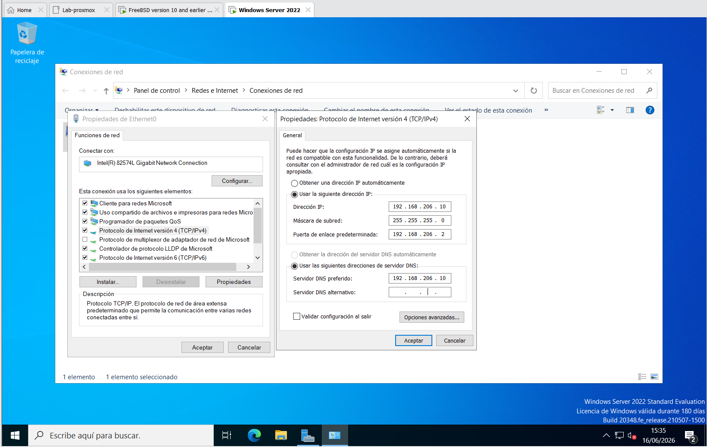

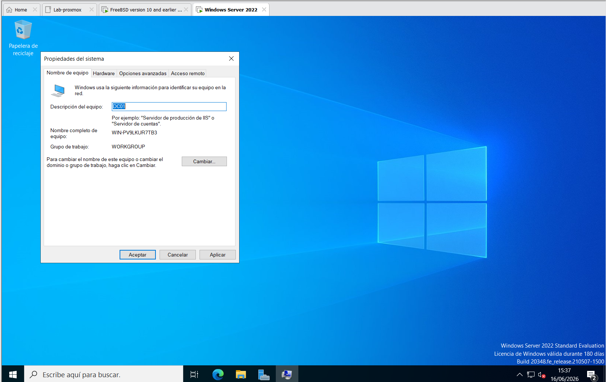

### Instalar el rol y promover el dominio

Con la red lista, instalé el rol **Servicios de dominio de Active Directory (AD DS)** desde el Administrador del servidor.

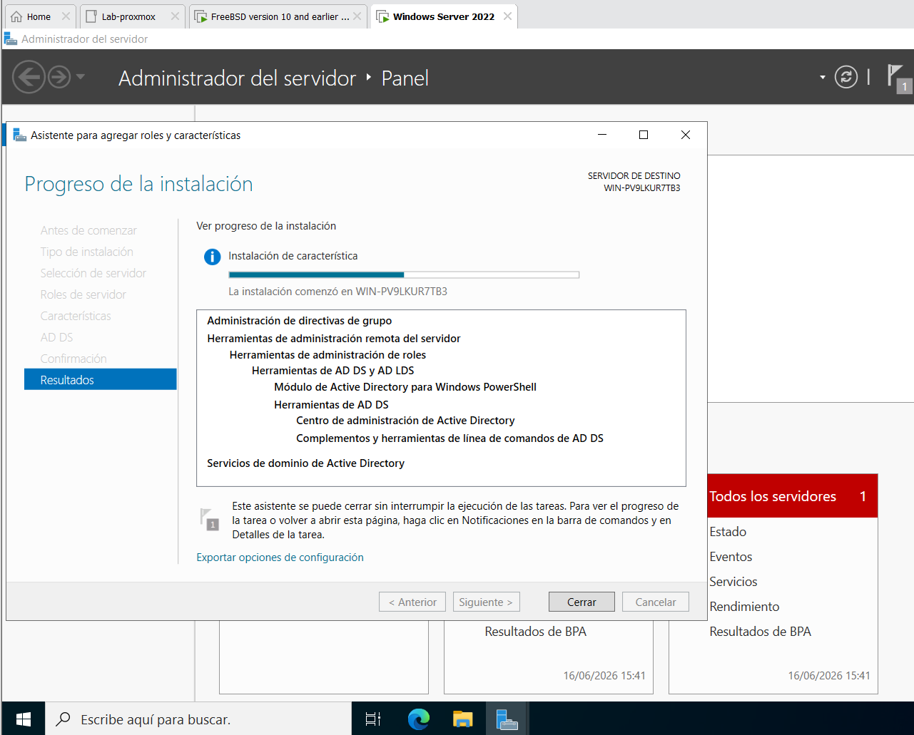

A continuación lo **promoví a controlador de dominio** creando un **bosque nuevo**: `lab.reiderer.dev`. El nombre lo elegí con criterio: usar un subdominio de un dominio que ya poseo (reiderer.dev) es la práctica que recomienda Microsoft, mejor que el clásico `.local`. Dejé el nivel funcional en Windows Server 2016 (el de por defecto), marqué que instalara también el **DNS**, y puse una contraseña de **DSRM** que, como cualquier secreto, vive en mi gestor de contraseñas y nunca en el repo.

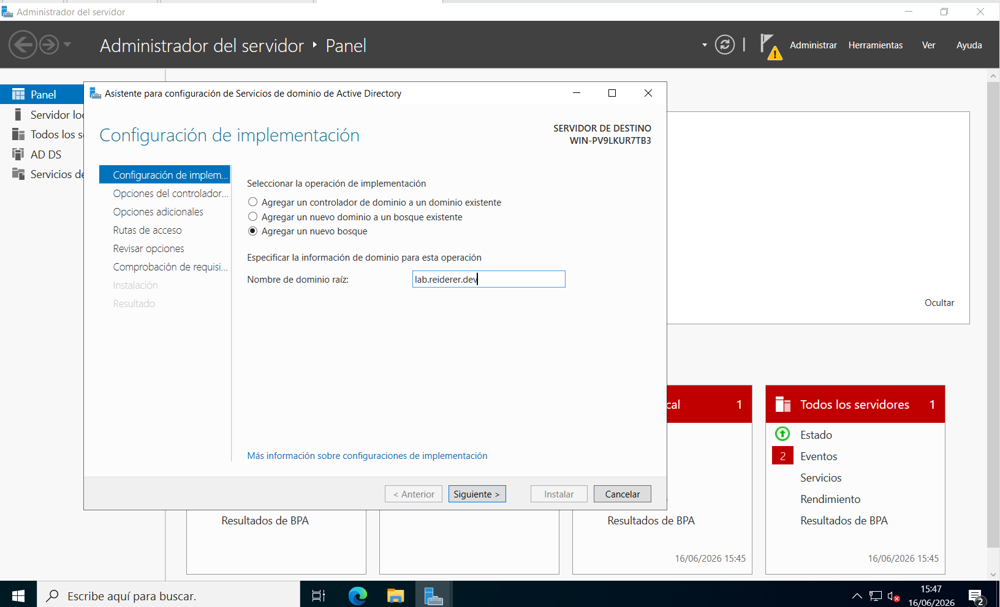

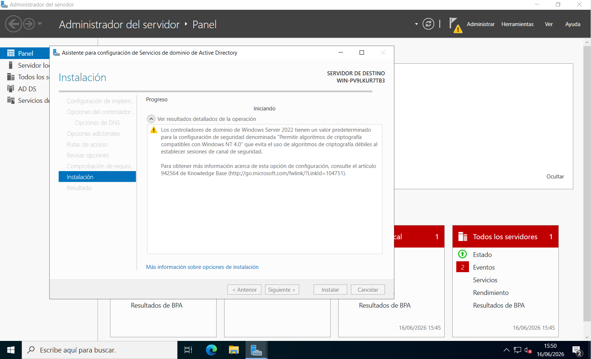

### Comprobar que el dominio está vivo

Tras el reinicio ya inicio sesión como `LAB\Administrator`. Un `Get-ADDomain` confirma que el bosque existe, con su nombre, su modo y los roles FSMO en su sitio:

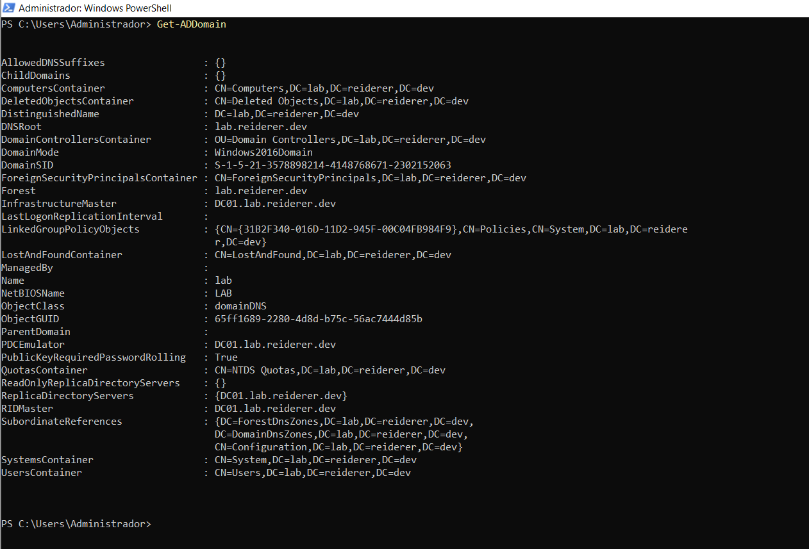

### Primera OU y primer usuario

Para darle a la identidad forma de organización, creé una **unidad organizativa** y dentro un **usuario** de prueba, desde "Usuarios y equipos de Active Directory":

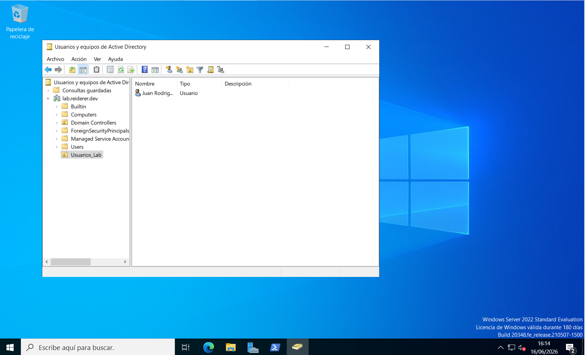

### Problemas que me encontré (y cómo los resolví)

- **Promoví el DC sin haberle fijado el nombre.** Quise renombrar el equipo a `DC01` antes de promoverlo, pero el cambio no llegó a aplicarse (faltó el reinicio que lo fija) y acabé promoviendo con el nombre automático de Windows (`WIN-PV9LKUR7TB3`). Lo descubrí justo en el `Get-ADDomain`: ahí estaba el nombre feo incrustado en todos los roles FSMO. **Aprendizaje:** el hostname se fija *antes* de promover, porque después ya no es "Cambiar y reiniciar". **Solución:** renombrar un DC ya promovido tiene su método soportado con `netdom computername` (añadir el nombre nuevo, hacerlo principal, reiniciar y quitar el viejo), que mantiene coherentes los SPN y los registros DNS. Tras eso, `Get-ADDomain` ya mostraba `DC01.lab.reiderer.dev` limpio.

### Estado

Dominio `lab.reiderer.dev` operativo sobre `DC01`, con DNS interno y la primera OU y usuario creados. La identidad del lab ya existe.

## Pieza 3 · DHCP — que los clientes nazcan dentro del dominio

### Por qué

Con la red (OPNsense) y la identidad (AD) en pie, faltaba que las próximas máquinas se integraran solas. La idea: que OPNsense reparta IP por DHCP, pero **entregando el controlador de dominio como DNS**, para que cualquier VM nueva pueda resolver y unirse a `lab.reiderer.dev` sin tocar nada a mano.

### Montaje

Mi versión de OPNsense usa **Kea DHCP** (la implementación nueva). Activé Kea DHCPv4 en la interfaz **LAN** y definí una subred:

- Subred `192.168.206.0/24`
- Rango (pool) `192.168.206.100 – 192.168.206.200` (dejo el tramo bajo para las IP estáticas)
- Puerta de enlace `192.168.206.2` (OPNsense)
- **DNS: `192.168.206.10` (el DC)**
- Dominio `lab.reiderer.dev`

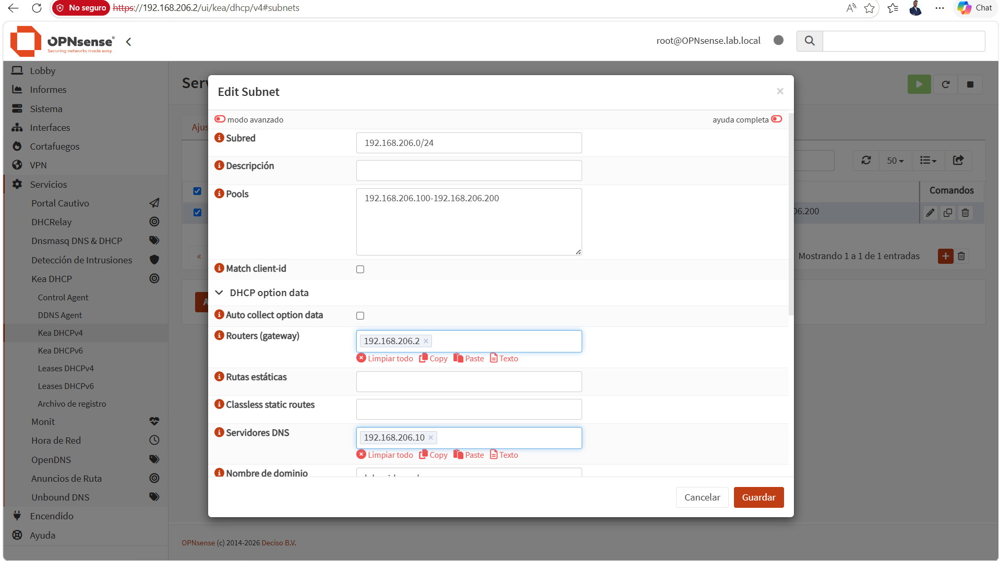

### Problemas que me encontré (y cómo los resolví)

- **Dos servidores DHCP en la misma red.** VMware trae su propio servicio DHCP activado por defecto en las redes host-only como VMnet1. Si enciendo el de OPNsense sin más, tendría dos repartiendo IPs en el mismo segmento, con direcciones aleatorias y conflictos. **Solución:** desactivar el DHCP de VMware en el Virtual Network Editor y dejar que mande solo OPNsense.

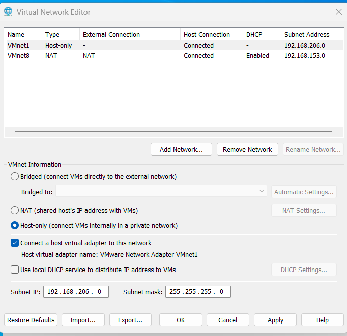

- **OPNsense se repartía a sí mismo como DNS.** En Kea, la opción *Auto collect option data* viene activada y hace que el firewall se entregue a sí mismo como servidor DNS. Con eso, los clientes resolverían contra OPNsense y no encontrarían el dominio. **Aprendizaje:** en un entorno con AD, el DNS de los clientes tiene que ser el controlador de dominio. **Solución:** desactivar *Auto collect option data* para que aparezcan los campos manuales y poner el DC (`192.168.206.10`) como servidor DNS.

### Estado

OPNsense repartiendo IP en la LAN con el DC como DNS. La prueba de fuego llegará con la primera VM cliente (el host de Docker), que debería nacer con una IP del rango y resolviendo el dominio sin que yo toque nada.

## Siguiente: Docker

- **Docker** sobre una VM ligera, con Portainer y algún servicio real. Además de cerrar la fase, será la máquina que valide el DHCP recién montado.

## Lo que me llevo (de momento)

- Un firewall no es "instalar y ya": es entender qué interfaz es qué, cómo se segmenta y cómo no chocar con redes existentes.
- OPNsense y pfSense son la misma familia (fork sobre FreeBSD); los conceptos de firewall son transferibles entre ambos, y también a soluciones comerciales como FortiGate.
- Por qué un **controlador de dominio va con IP estática**, y por qué el nombre del equipo se fija *antes* de promover (y cómo se arregla con `netdom` si se te pasa).
- Que en un dominio **el DNS de los clientes es el DC**, no un DNS público: es lo que les permite encontrar y unirse al dominio.
- Cómo encajan **red e identidad** a través del DHCP: OPNsense reparte, pero entrega el AD como DNS, y así cada máquina nueva nace integrada.
- Saber adaptar el entorno (VMware en lugar de Proxmox anidado) sin perder el objetivo del proyecto.
